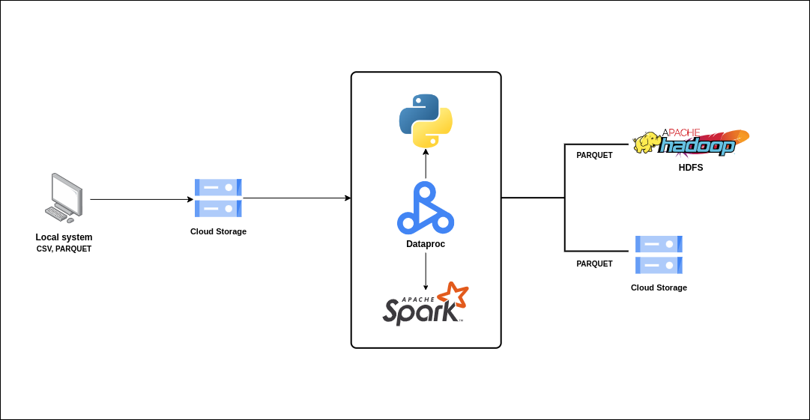

# Pipeline for ETL US Prescribers Data, creatung multiple reports based on requirements

## Pipeline Flowchart

## Steps
### Data ingestion
1. Data upload to GCS Bucket for availability.  

### Data preprocessing
1. Performed data cleaning for Cities and Prescribers datasets.  
2. Performed transformations to make data suitable for joining.  

### Data transform
1. Creation of reports based on requirements.  
1.1 Prescribers report requirements:  
emsp Top 5 Prescribers with highest trx_cnt per each state.  
*Tabspace* Consider the prescribers only from 20 to 50 years of experience.  
*Tabspace* Table Model:  
*Tabspace* *Tabspace* Prescriber ID  
*Tabspace* *Tabspace* Prescriber Full Name  
*Tabspace* *Tabspace* Prescriber State  
*Tabspace* *Tabspace* Prescriber Country  
*Tabspace* *Tabspace* Prescriber Years of Experience  
*Tabspace* *Tabspace* Total TRX Count  
*Tabspace* *Tabspace* Total Days Supply  
*Tabspace* *Tabspace* Total Drug Cost  

1.2 Cities report requirements:  
    Calculate the Number of zips in each city.  
    Calculate the number of distinct Prescribers assigned for each City.  
    Calculate total TRX_CNT prescribed for each city.  
    Do not report a city in the final report if no prescriber is assigned to it.  
    Table Model:  
       City Name  
       State Name  
       County Name  
       City Population  
       Number of Zips  
       Prescriber Counts  
       Total Trx counts  

### Data load
1. Load transformed data to HDFS for optimization for further reading and/or transformations.  
2. Load transformed data to GCS for avalability and presentation.  

## This pipeline includes the usage of following tools and languages  
1. Python and PySpark  
2. Google Cloud Platform, Cloud Storage, Dataproc and GCP CLI  
3. Hadoop File System HDFS  
4. Logging for optimizing debug stages and testing  
